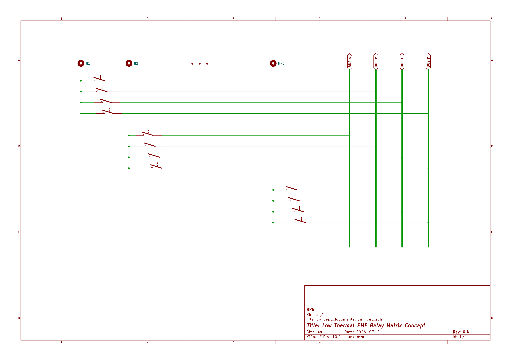
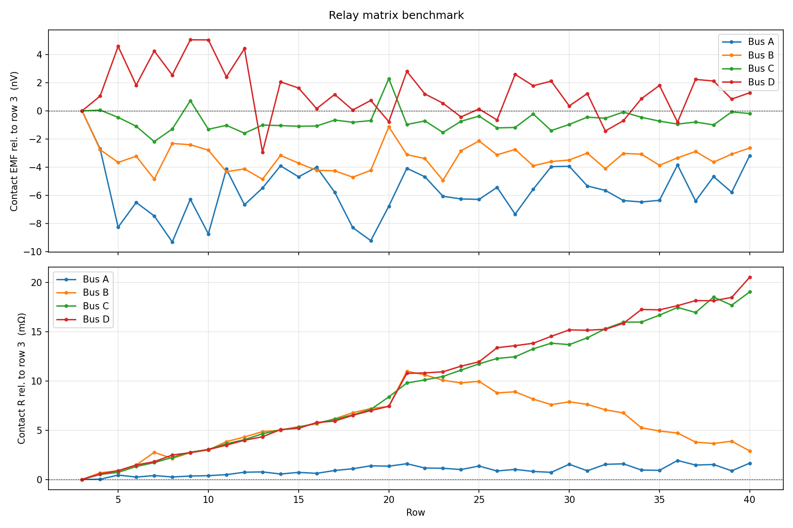
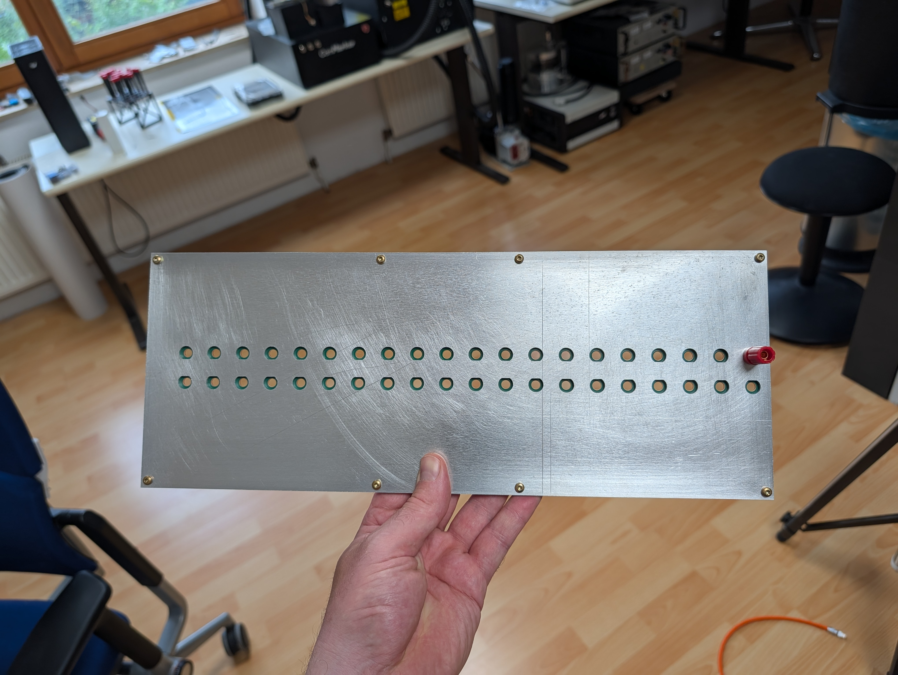
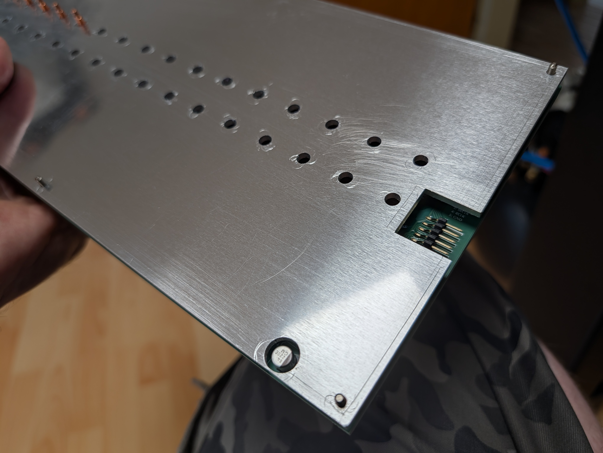
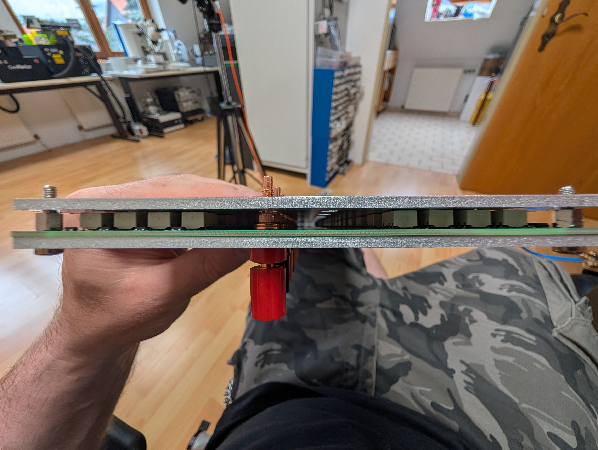
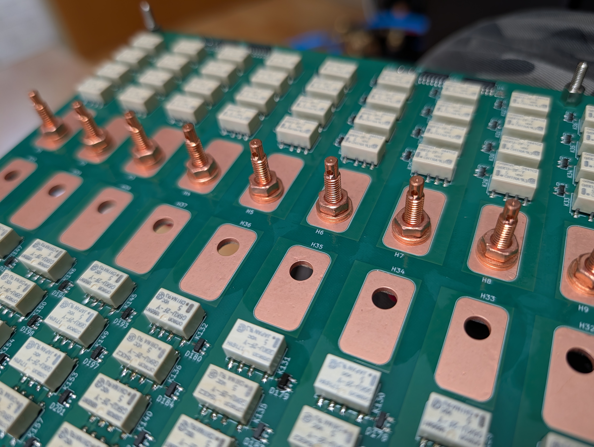
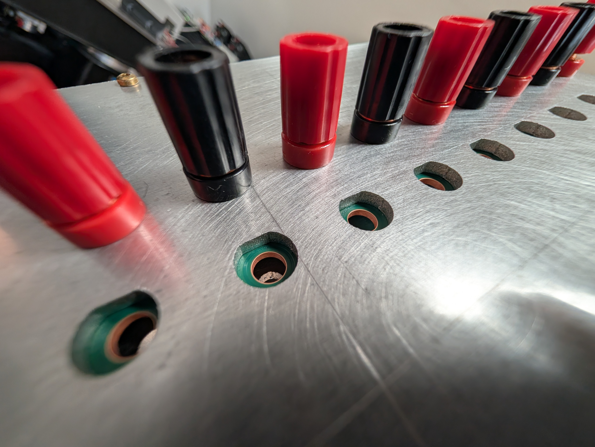
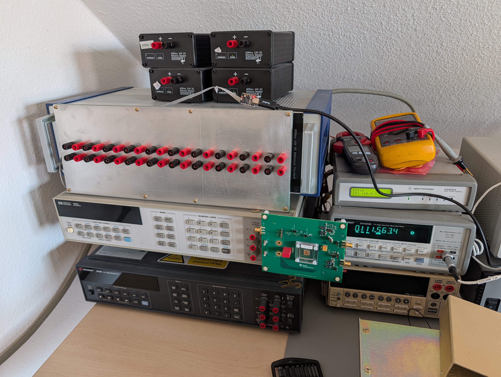

# low_TEMF_relay_matrix

A low-thermal EMF relay matrix board designed for **automated 4-wire resistance measurements** and **NBS 430 voltage supervision**. Needs 5V supply and an external microcontroller to feed data into a shift register bucket brigade. Oblong terminal pads for cable shoes or brinding posts. <19" wide board for possible rack installation.

---

## Changelog

### Version 0.5
* Exposed GND copper plane around a mounting hole for convenient shield/enclosure chassis connection
* Criss-cross pattern on layers 2,3 instead of identical traces to minimize path resistance

### Version 0.4
* Symmetric annotations
* Added test points connected directly to the four buses
* Added silkscreen logos

---

## Recommended PCB

* 4 layer
* OSP (a bit difficult to strip but gives bare copper pads)
* Gold plating shouldn't be much worse

---

## Images

### Overview
| 3D Render | Concept |
| :---: | :---: |
|  |  |

### Schematics
| Relay Driver | Relay Block |
| :---: | :---: |
|  |  |

### Performance
| Test Results of 0.4|
| :---: |
|  |

### Heat spreader example
| Front | Rear | Sandwitch |
| :---: | :---: | :---: |
|  |  |  |

| Taobao Terminals | 3mm Al plate | 19" width |
| :---: | :---: | :---: |
|  |  |  |

---

